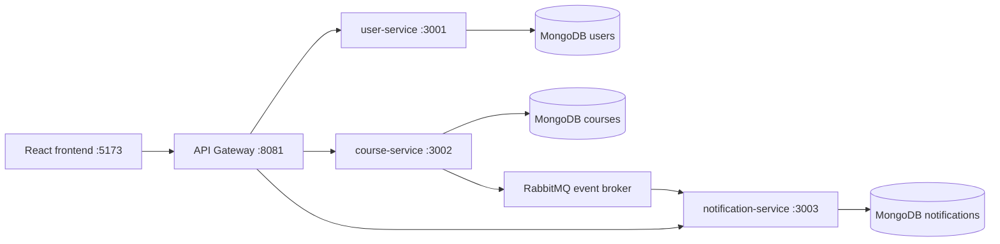

# VDT Microservice Demo

Project demo này minh họa cách tách một nền tảng đào tạo trực tuyến từ kiến trúc monolith sang microservices. Ứng dụng dùng ReactJS cho frontend, Node.js/Express cho backend services, MongoDB làm database riêng cho từng service và API Gateway làm điểm vào duy nhất cho frontend.

## Mục tiêu demo

- Cho thấy frontend không gọi trực tiếp các service nội bộ, mà đi qua API Gateway.
- Minh họa pattern Database per Service: mỗi service sở hữu MongoDB riêng.
- Có nghiệp vụ đủ rõ để demo phân quyền:
  - Admin đăng nhập vào dashboard để quản lý thành viên, khóa học và thông báo.
  - Học viên đăng nhập, đăng ký khóa học, xem thông báo cá nhân, đánh dấu đã đọc và đánh dấu học xong.
- Minh họa event-driven communication: `course-service` publish event khi học viên đăng ký hoặc hoàn thành khóa học, `notification-service` consume event để tạo thông báo.

## Công nghệ

- Frontend: React 18, Vite, lucide-react.
- API Gateway: Node.js, Express, http-proxy-middleware.
- Services: Node.js, Express, Mongoose.
- Database: MongoDB 7, mỗi service một database/container riêng.
- Event broker: RabbitMQ.
- Runtime: Docker Compose.

## Cấu trúc thư mục

```text
.
├── apps
│   ├── api-gateway              # Gateway route /api/* tới service nội bộ
│   └── frontend                 # React + Vite UI
├── services
│   ├── user-service             # Đăng nhập, quản lý người dùng
│   ├── course-service           # Khóa học, đăng ký, học xong
│   └── notification-service     # Thông báo cá nhân
├── docs
│   └── architecture.md          # Sơ đồ và ghi chú kiến trúc
├── docker-compose.yml           # Toàn bộ stack demo
├── package.json                 # Script chạy project
└── README.md
```

Tài liệu bổ sung:

- [docs/architecture.md](docs/architecture.md): ghi chú kiến trúc và mapping với slide.
- [docs/demo-guide.md](docs/demo-guide.md): kịch bản demo sau khi thuyết trình xong slide.

## Kiến trúc



Gateway publish ra host tại `localhost:8081`. Các service chỉ giao tiếp trong Docker network.

## Yêu cầu cài đặt

- Docker Desktop hoặc Docker Engine có hỗ trợ Docker Compose.
- Node.js/npm nếu muốn chạy lệnh npm ở root project.

Không cần cài MongoDB local vì Docker Compose đã tạo 3 MongoDB riêng.

## Chạy nhanh

Từ thư mục project:

```bash
npm run dev
```

Lệnh này tương đương:

```bash
docker compose up --build
```

Mở ứng dụng:

- Frontend: http://localhost:5173
- API Gateway: http://localhost:8081
- Health check: http://localhost:8081/health
- RabbitMQ Management UI: http://localhost:15672 (`guest` / `guest`)

Nạp lại dữ liệu mẫu:

```bash
npm run seed
```

Dừng stack:

```bash
npm run down
```

Xem log:

```bash
npm run logs
```

## Tài khoản demo

| Vai trò | Email | Mật khẩu |
| --- | --- | --- |
| Admin | `admin@vdt.edu.vn` | `admin123` |
| Học viên | `minhanh@vdt.edu.vn` | `student123` |

## Luồng demo đề xuất

### 1. Admin

1. Đăng nhập bằng tài khoản admin.
2. Quan sát dashboard tổng quan.
3. Thêm hoặc xóa thành viên.
4. Thêm hoặc xóa khóa học.
5. Gửi thông báo cho một học viên hoặc tất cả học viên.
6. Lưu ý: màn hình admin không hiển thị chuông thông báo; admin quản lý thông báo trong section `Thông báo`.

### 2. Học viên

1. Đăng nhập bằng tài khoản học viên.
2. Xem `Khóa học hiện có`.
3. Bấm `Đăng ký` một khóa học.
4. Thông báo mới xuất hiện trong chuông thông báo.
5. Xem `Khóa học đã đăng ký`.
6. Bấm `Đã đọc` trong khu vực `Thông báo cần đọc`.
7. Bấm `Học xong` trên khóa đã đăng ký.
8. Khóa học chuyển sang trạng thái `Đã học xong` và hệ thống tạo thêm thông báo hoàn thành.

## API chính

Tất cả API bên dưới đi qua Gateway tại `http://localhost:8081/api`.

### Đăng nhập

```bash
curl -X POST http://localhost:8081/api/auth/login \
  -H "Content-Type: application/json" \
  -d '{"email":"admin@vdt.edu.vn","password":"admin123"}'
```

### Người dùng

```bash
curl http://localhost:8081/api/users
```

Tạo người dùng:

```bash
curl -X POST http://localhost:8081/api/users \
  -H "Content-Type: application/json" \
  -d '{
    "fullName": "Nguyễn Văn A",
    "email": "vana@vdt.edu.vn",
    "password": "student123",
    "role": "student"
  }'
```

### Khóa học

```bash
curl http://localhost:8081/api/courses
```

Tạo khóa học:

```bash
curl -X POST http://localhost:8081/api/courses \
  -H "Content-Type: application/json" \
  -d '{
    "title": "Node.js Microservices",
    "description": "Xây dựng service độc lập với Express và MongoDB.",
    "instructorId": "admin",
    "level": "intermediate",
    "lessons": [
      { "title": "Service boundary", "durationMinutes": 30 }
    ]
  }'
```

Đăng ký khóa học:

```bash
curl -X POST http://localhost:8081/api/enrollments \
  -H "Content-Type: application/json" \
  -d '{"courseId":"COURSE_ID","userId":"USER_ID"}'
```

Đánh dấu học xong:

```bash
curl -X POST http://localhost:8081/api/enrollments/complete \
  -H "Content-Type: application/json" \
  -d '{"courseId":"COURSE_ID","userId":"USER_ID"}'
```

### Thông báo

Lấy toàn bộ thông báo:

```bash
curl http://localhost:8081/api/notifications
```

Lấy thông báo của một học viên:

```bash
curl "http://localhost:8081/api/notifications?userId=USER_ID"
```

Gửi thông báo cho một học viên:

```bash
curl -X POST http://localhost:8081/api/notifications \
  -H "Content-Type: application/json" \
  -d '{
    "userId": "USER_ID",
    "title": "Thông báo mới",
    "message": "Bạn có một cập nhật mới trong hệ thống.",
    "type": "system"
  }'
```

Đánh dấu thông báo đã đọc:

```bash
curl -X PATCH http://localhost:8081/api/notifications/NOTIFICATION_ID/read
```

## Event-driven demo

RabbitMQ được dùng cho các event nghiệp vụ phát sinh từ `course-service`.

| Hành động | Service publish | Event | Service consume | Kết quả |
| --- | --- | --- | --- | --- |
| Học viên đăng ký khóa học | `course-service` | `CourseEnrollmentCreated` | `notification-service` | Tạo thông báo đăng ký thành công |
| Học viên bấm học xong | `course-service` | `CourseCompleted` | `notification-service` | Tạo thông báo hoàn thành khóa học |

RabbitMQ Management UI:

- URL: http://localhost:15672
- Username: `guest`
- Password: `guest`

Các thành phần chính:

- Exchange: `vdt.events`
- Queue: `notification-service.course-events`
- Routing keys:
  - `course.enrollment.created`
  - `course.completed`

## Scripts

| Lệnh | Ý nghĩa |
| --- | --- |
| `npm run dev` | Build và chạy toàn bộ stack bằng Docker Compose |
| `npm run seed` | Xóa và nạp lại dữ liệu mẫu cho 3 service |
| `npm run logs` | Theo dõi log của toàn bộ containers |
| `npm run down` | Dừng stack, giữ lại Docker volumes |

## Dữ liệu và persistence

Docker Compose tạo 3 volumes:

- `user_mongo_data`
- `course_mongo_data`
- `notification_mongo_data`

`npm run down` chỉ dừng containers, không xóa dữ liệu. Nếu muốn reset toàn bộ database:

```bash
docker compose down -v
npm run dev
npm run seed
```

## Troubleshooting

### Cổng 8081 hoặc 5173 bị chiếm

Sửa mapping port trong `docker-compose.yml`, ví dụ:

```yaml
api-gateway:
  ports:
    - "8082:8080"
```

Nếu đổi gateway public port, cập nhật luôn `VITE_API_BASE_URL` của frontend.

### Frontend không có dữ liệu

Chạy lại seed:

```bash
npm run seed
```

Sau đó reload trình duyệt.

### Gateway báo upstream down

Kiểm tra trạng thái containers:

```bash
docker compose ps
docker compose logs api-gateway
```

Health check tổng:

```bash
curl http://localhost:8081/health
```

### Thay đổi code nhưng UI chưa cập nhật

Rebuild lại frontend:

```bash
docker compose up --build -d frontend
```

## Ghi chú kiến trúc

- Demo dùng đăng nhập đơn giản bằng email/password lưu thẳng trong database để phục vụ minh họa. Không dùng cho production.
- Luồng đăng ký/học xong đang dùng RabbitMQ để minh họa event-driven. `course-service` publish event, `notification-service` consume event và tạo thông báo.
- Mỗi service có MongoDB riêng, tránh query chéo database. Nếu service cần dữ liệu từ service khác, hãy đi qua API hoặc event.
