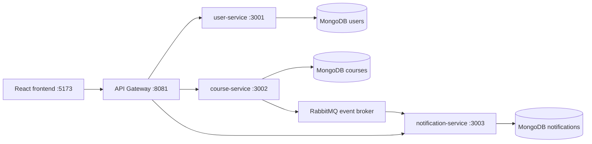

# Kiến trúc demo

## Mapping với nội dung slide

- Monolith ban đầu: tất cả module user, course, notification nằm chung một ứng dụng.
- Microservices: tách theo business capability, mỗi service có codebase và database riêng.
- API Gateway: frontend chỉ cần biết một endpoint, gateway chuyển request về đúng service.
- Database per Service: không service nào query trực tiếp database của service khác.
- Event-Driven Architecture: `course-service` publish event vào RabbitMQ, `notification-service` consume event và tạo thông báo.

## Luồng đăng ký khóa học

1. React gọi `POST /api/enrollments` đến API Gateway.
2. Gateway proxy request đến `course-service`.
3. `course-service` thêm `userId` vào `enrolledUserIds` trong course database.
4. `course-service` publish event `CourseEnrollmentCreated` vào RabbitMQ.
5. `notification-service` consume event từ RabbitMQ.
6. `notification-service` tạo thông báo cá nhân cho học viên.
7. React refresh danh sách khóa học và thông báo qua Gateway.

## Luồng học xong

1. React gọi `POST /api/enrollments/complete` đến API Gateway.
2. Gateway proxy request đến `course-service`.
3. `course-service` thêm `userId` vào `completedUserIds`.
4. `course-service` publish event `CourseCompleted`.
5. `notification-service` consume event và tạo thông báo hoàn thành khóa học.

## Vì sao dùng event broker?

- `course-service` không cần gọi trực tiếp API của `notification-service`.
- Nếu `notification-service` tạm thời chậm hoặc restart, event vẫn có thể nằm trong queue.
- Có thể thêm service mới consume cùng event, ví dụ `reporting-service` hoặc `email-service`, mà không cần sửa `course-service`.
