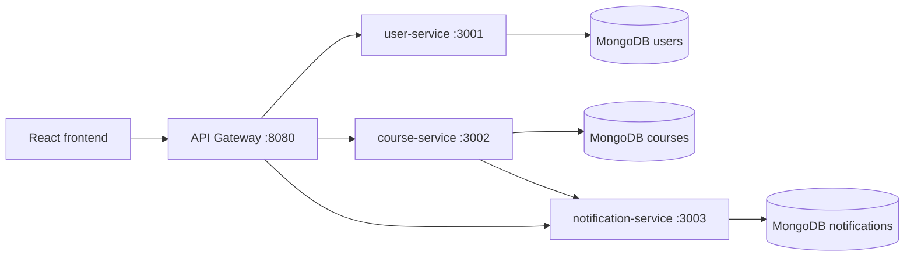

# Kien truc demo

## Mapping voi noi dung slide

- Monolith ban dau: tat ca module user, course, notification nam chung mot ung dung.
- Microservices: tach theo business capability, moi service co codebase va database rieng.
- API Gateway: frontend chi can biet mot endpoint, gateway chuyen request ve dung service.
- Database per Service: khong service nao query truc tiep database cua service khac.
- Event-driven mindset: trong demo nay `course-service` goi `notification-service` bang HTTP de de quan sat. Khi nang cap, co the thay bang message broker nhu RabbitMQ, Kafka hoac NATS.

## Luong dang ky khoa hoc

1. React goi `POST /api/enrollments` den gateway.
2. Gateway proxy request den `course-service`.
3. `course-service` them `userId` vao khoa hoc.
4. `course-service` gui thong bao sang `notification-service`.
5. React refresh danh sach course va notification qua gateway.
